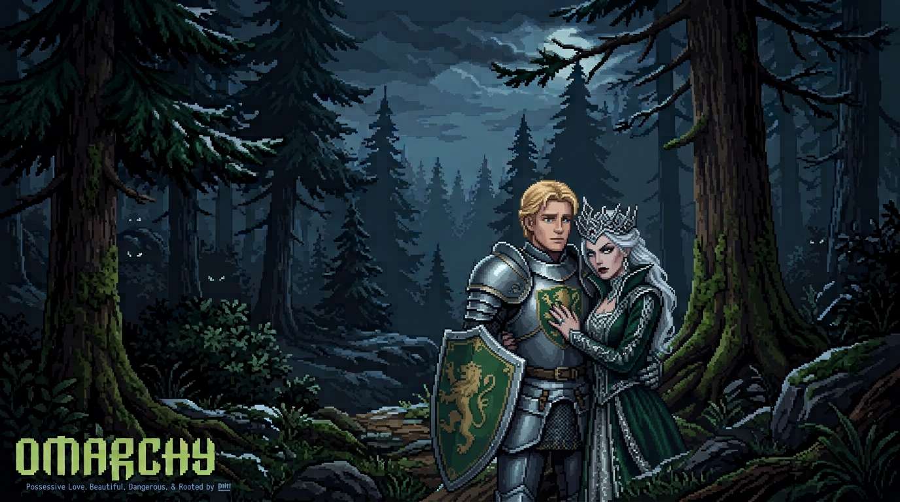
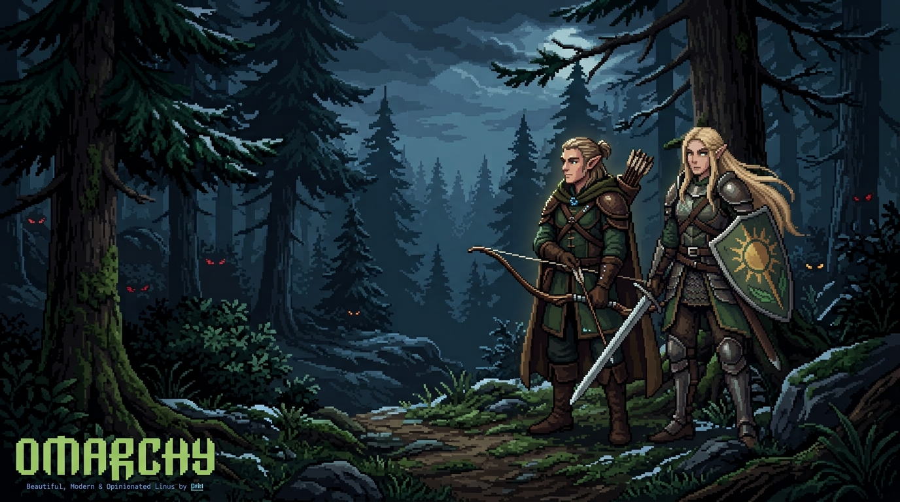
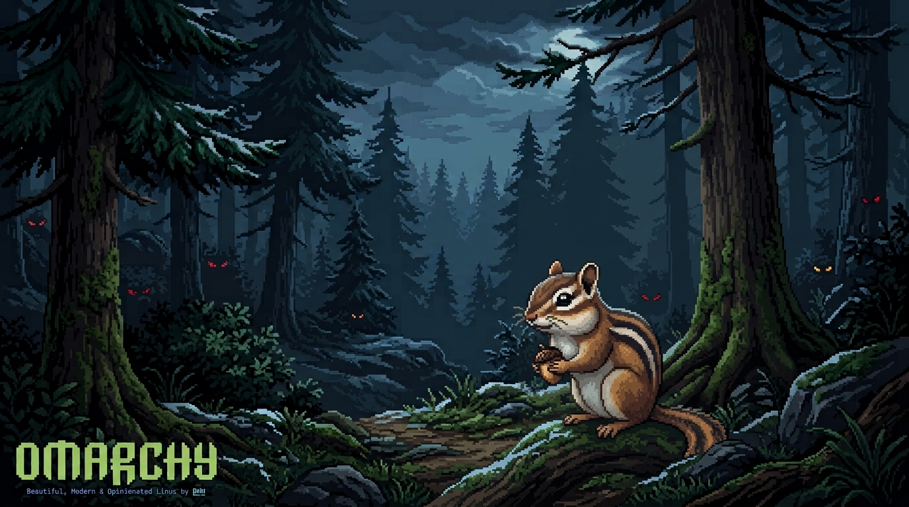
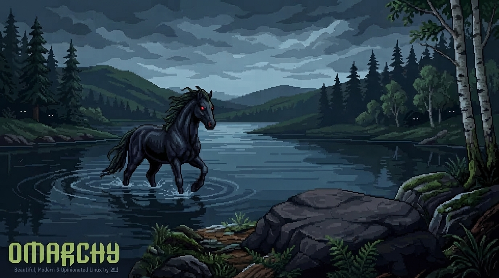
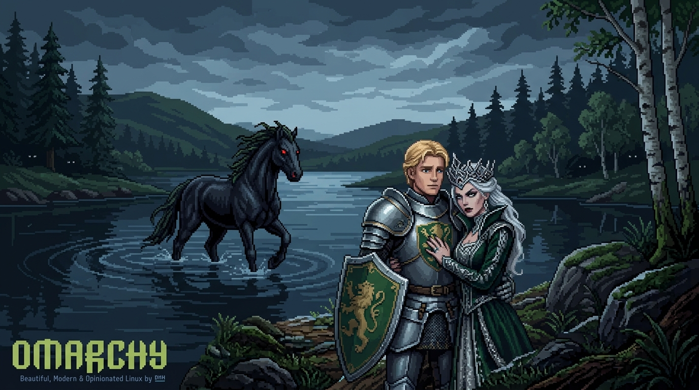
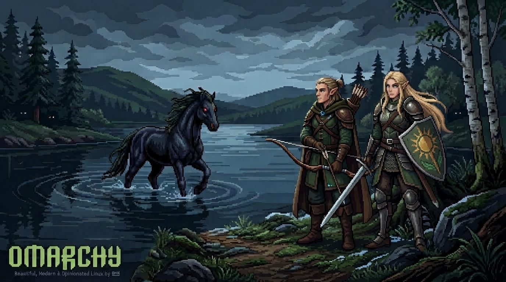

# 🌲 Pixelart Fantasy - Omarchy Theme
  

Um tema para o **Omarchy Linux** com atmosfera de RPG em Pixel Art e a fluidez do **Hyprland**, usando tons de verde oliva, dourado e cinza.


## 📸 Conceito e Wallpapers

* **A Jornada dos Heróis:** Cavaleiro e Rainha na floresta.


---

* **Os Guardiões da Mata:** Dupla de elfos.


---

* **O Chipmunk Solitário:** Variações com o chipmunk explorando a natureza.


---

* **As Margens do Loch (O Each-Uisge):** Ambiente à beira de um lago escocês com alusão ao espírito mitológico Each-Uisge.








---


## 🛠 O que está incluído

* **Backgrounds:** Wallpapers em pixel art.
* **Colors.toml:** Sincronização de cores.
* **Icons & Assets:** Customizações visuais.

## 🚀 Como usar

```bash
omarchy theme install https://github.com
```

# Este é meu primeiro tema, espero que gostem.
* Estou sempre postando novos wallpapers. 
* Não deixe de conferir meus próximos temas.
* E por favor, curta e me siga para me apoiar.
---


## 📱 Redes Sociais

[](https://www.linkedin.com/in/fernando-rodrigues-de-sousa-silva-4b63543b4/) [](https://www.instagram.com/daron_fen?utm_source=qr&stkn=MW1ieHV4NTRycXY4bQ==)  [](mailto:daronfen@gmail.com) 